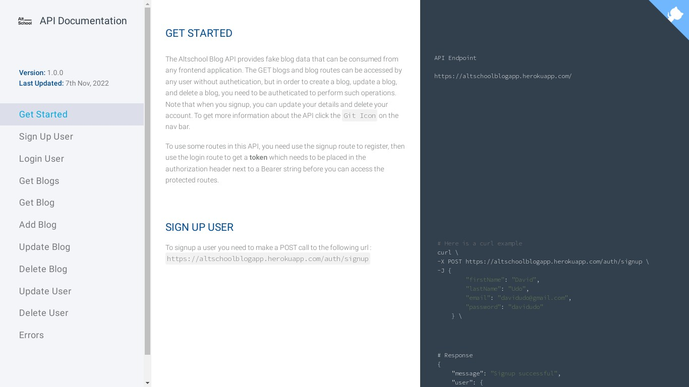

# Altschool Blog API Documentation Website

This documentation website has the same content as the `README` file in the root directory. It's purpose is to guide other developers that intend to use the API. It has contains all the information about the `blog`, `auth`, and `user` routes.

## View website
You can use this [link](https://altschoolblogapp.herokuapp.com/) to view the documentation website.